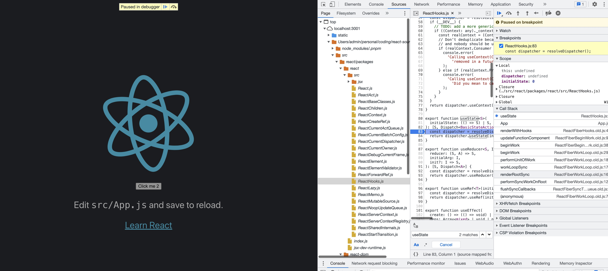
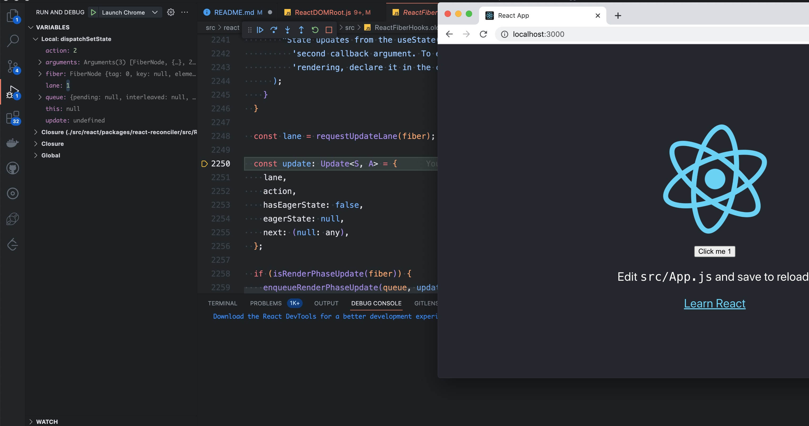

## React 源码调试

直接调试源码，不需要打包，这个项目是基于 react v18.2.0 修改一些源码文件达到直接 map 到源码文件

## 安装

1. clone 项目到本地(包括子模块)

```bash
git clone --recursive https://github.com/jackluson/react-source-debugger.git # 包含react子模块
```

or

```bash
git clone  https://github.com/jackluson/react-source-debugger.git

# 然后在初始化子模块
git submodule init
git submodule update --depth=1
```

2. 安装

```bash
#demo项目安装
npm install

# 进入源码子模块安装
cd src/react
npm install
```

## 使用

两种使用方式

- npm run start 直接打开浏览器，打开控制台，打断点调试



- 通过 vscode 调试，配置文件在.vscode/launch.json
  

## Reference

- [React 之如何调试源码](https://juejin.cn/post/7168821587251036167)
